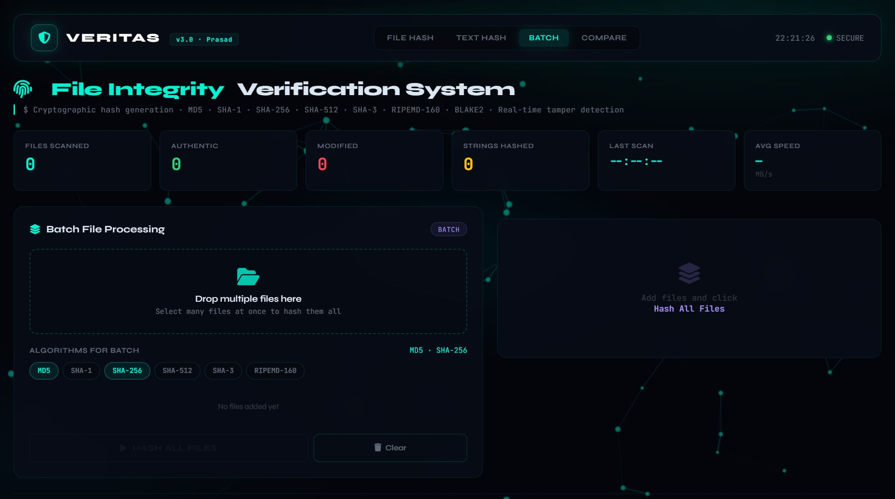

# VERITAS File Integrity System

A powerful client side cryptographic hash generator for file integrity verification.

## Features
- Multiple hash algorithms: MD5, SHA-1, SHA-256, SHA-512, SHA-3, RIPEMD-160
- File hashing with drag & drop support
- Text/string hashing with HEX/Base64 output
- Batch file processing
- Hash comparison with visual diff
- Hash algorithm identifier
- Export results (TXT, JSON, CSV)
- Scan history with local storage
- QR code generation for hash sharing

## Live Demo
[https://Laxdip.github.io/veritas-file-integrity/](https://Laxdip.github.io/veritas-file-integrity/)

## 📸 Screenshots

<div align="center">
  
| | |
|:-:|:-:|
|  |  |
| <kbd>File Hash Tab</kbd> | <kbd>Text Hash Tab</kbd> |

| | |
|:-:|:-:|
|  |  |
| <kbd>Batch Processing</kbd> | <kbd>Hash Compare & Identify Tool</kbd> |

</div>

## Installation
No installation required! This is a web-based tool that runs entirely in your browser.
```
Option 1: Use Online (No Setup)
Simply visit: [https://Laxdip.github.io/veritas-file-integrity/](...)

Option 2: Run Locally
git clone https://github.com/Laxdip/veritas-file-integrity.git
cd veritas-file-integrity
python -m http.server 8080

Option 3: Download & Use Offline
1.Download index.html from the repository
2.Open it in any modern browser
3.No internet connection required after download

⚠️ Note: When opening index.html directly (file:// protocol), some features like QR generation may have limitations.For full functionality, use a local server (Option 2).
```
## Tech Stack
- HTML5 / CSS3
- JavaScript (ES6+)
- CryptoJS for cryptographic functions
- QRCode.js for QR generation
- LocalStorage for history persistence

## Usage
1. Upload a file or paste text
2. Select hash algorithms
3. Generate hashes instantly
4. Verify integrity against known hashes
5. Export or share results via QR

## License
MIT

## Author
Prasad
